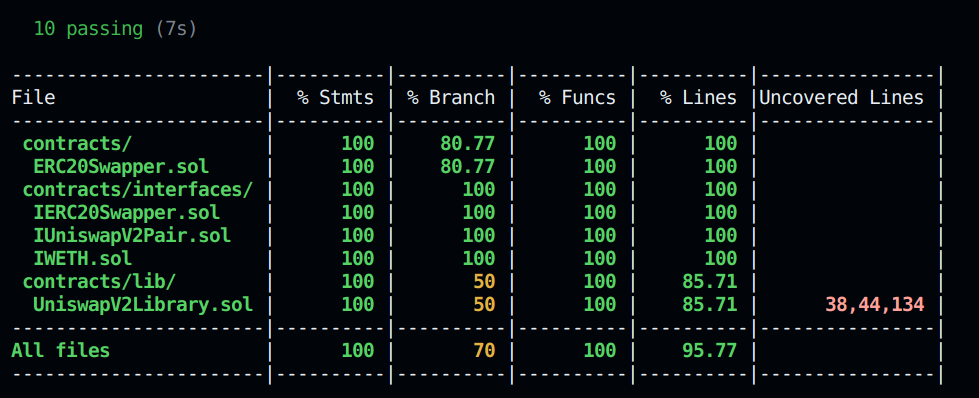

# Overview
The ERC20Swapper contract is designed to facilitate the swapping of Ether (ETH) for any ERC20 token through the Uniswap V2 decentralized exchange protocol. It leverages the OpenZeppelin library for upgradeable contracts, ensuring that the contract can be updated after deployment to include new features or fix potential issues without losing its state or having to deploy a new contract.

# Key Features
**Swap Functionality:** Provides a function to swap ETH for ERC20 tokens in a single transaction, utilizing the liquidity pools available on the Uniswap V2 platform.

**Safety Checks:** Incorporates safety checks to prevent operations with the zero address, mitigating common risks and ensuring transactions are executed with valid contract addresses.

**Immutable WETH Address:** The Wrapped Ethereum (WETH) address is set as immutable upon contract deployment, ensuring that all ETH to ERC20 swaps correctly utilize the WETH token as an intermediary for swaps on Uniswap V2.

**Inbuilt SwapRouter:** This contract has developed its own internal swap router, eliminating the reliance on the UniswapV2Router. This capability allows for direct interaction with the WETH-token pair contract, which can be accessed using the getPair function.

# Properties: 
## Safety and trust minimization:
The assets of the user remain secure throughout the swap process; this is achieved by the contract first converting the received ETH from the user into WETH, followed by transferring it to the pairAddress for a WETH-token swap. This ensures the safety of user assets during the exchange.

The contract has an owner as it implements `Ownable2StepUpgradeable` which provides extra safety mechanism by only transferring the ownership when another address(pendingOwner) calls the `acceptOwnership` function. The owner is able to call restricted functions like `setfactoryAddress` which is used to update the address of the factory contract if changed in future.

## Performance
Gas usage for the following transactions:
- Deployment: 2,317,376 units of gas([tx](https://sepolia.etherscan.io/tx/0xe6d1535d1d72b960888468c50ca5a6f18135e3fe8b6f7838cf916cb30b899aa2))
- `SwapEtherToToken` execution: 129,868 units of gas([tx](https://sepolia.etherscan.io/tx/0x1048f5d0e3e3d3af90530d636e9daa9714ae7287907ae32fbd0fe8ee050f0c8f))

## Upgradeability
The contract is deployed via `TransparentUpgradeableProxy` which makes it super flexible to upgrade the contract if need in future due to any reason either it is vulnerability in the DEX used or the liquidity drains.

## Usability and interoperability
The contract is super flexible to use for EOAs as it just needs user to pass the tokenOut address along with the minimum amount user is expecting from the swap, all other things like **path** for the swap is created by the contract itself which makes it super flexible to use for EOAs and other contracts to operate with it.

## Readability and code quality
### Code Structure:
The contract is well-structured, with a clear separation of concerns evident in the layout of variables, modifiers, constructor, external functions, and internal logic. This structuring aids in readability and makes the contract easier to navigate.

### Comments and Documentation:
The contract is well-documented with comments above each function and event, explaining their purpose, parameters, and behavior. This is good practice and greatly aids any developer reading the code to understand its functionality quickly. The inclusion of NatSpec comments for the Solidity documentation would further enhance understanding at a glance.

### Error Handling:
Custom errors (ZeroAddressNotAllowed, OutputAmountBelowMinimum,SwapAmountLessThanAmountOutMin etc) are defined, providing clear, concise feedback on why a function call might fail, which is more gas-efficient and user-friendly than require messages.

The contract's robustness and functionality can be thoroughly verified via comprehensive fork tests specifically designed to encompass a broad spectrum of edge cases, ensuring a high level of confidence in its reliability and performance under various conditions.

# Swap Mechanism
The core functionality is the `swapEtherToToken` function, which takes ETH from the user (sent along with the transaction) and swaps it for the specified ERC20 token. The function parameters include the target token's address and the minimum amount of tokens the user is willing to accept for their ETH. The swap leverages Uniswap V2's pair address calculated through the uniswapV2Factory address, tokenIn, tokenOut and INIT_CODE_HASH with the contract automatically constructing the swap path via the WETH token.

### Run project by following the steps below:

Create a new `.env` file by duplicating the `.env.example` file, and ensure to incorporate the configurations specified in `.env.example`.

Install node:
```shell
nvm install v18.0.0
```

Then run command to use the installed node version
```shell
nvm use v18.0.0
```

First install the dependencies:
```shell
yarn install
```

To compile the smart contracts use command:
```shell
npx hardhat compile
```

To run fork test cases use command:
```shell
npx hardhat test
```
**Ensure to add RPC URL in .env**

To deploy ERC20Swapper on hardhat local network use command:
```shell
npx hardhat run scripts/deployERC20Swapper.ts
```

To deploy ERC20Swapper on testnet or mainnet use command:
```shell
npx hardhat run scripts/deployERC20Swapper.ts --network <network name>
```

**To deploy on network remember to save network url, api key, private key in .env file which will be exported in hardhat.config.ts file.**

The ERC20Swapper contract is deployed on sepolia:
[`0xb111893228437B912A01dD9Bf2cA039fd62476aC.`](https://sepolia.etherscan.io/address/0xb111893228437B912A01dD9Bf2cA039fd62476aC.)

## Coverage:


# Conclusion

This contract is a powerful tool for DeFi applications, enabling users to easily convert their ETH into any ERC20 token supported by Uniswap V2. It's designed with flexibility and future growth in mind, thanks to its upgradeable nature, while prioritizing user safety through rigorous checks and balances.